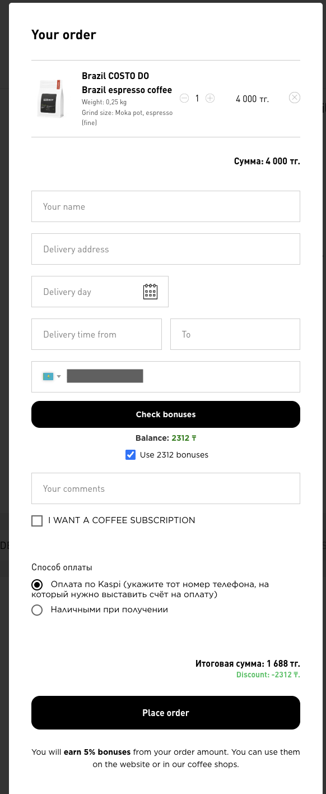
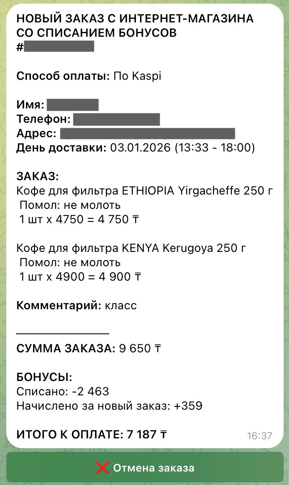
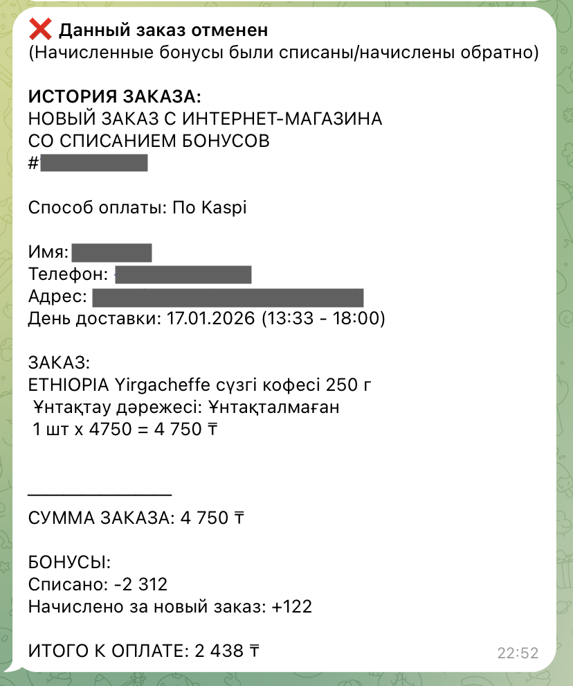
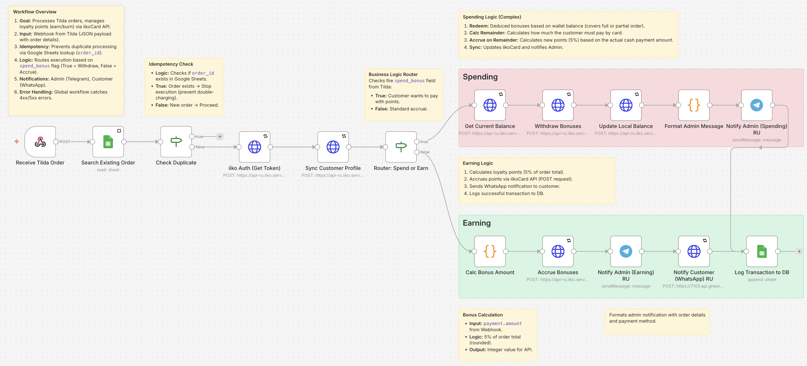

# Интеграция системы лояльности (Production): Tilda + iikoCard (n8n, APIs, webhooks)

[🇺🇸 English Version](README.md)

> **Используется в продакшене**, разработан для сети кофеен (4 точки) в Алматы.
> Оркестрирует потоки данных между фронтендом (Tilda), движком лояльности (iikoCard) и мессенджерами.

---

## 📸 Обзор системы

### 1. Результат (Frontend и UI Админа)
Кастомные JS-скрипты позволяют клиентам проверять баланс. Админы получают уведомления и могут **отменять заказы** прямо из Telegram.

| UI Клиента (Tilda) | Алерт Админа (Telegram) |
| :---: | :---: |
|  |   ⬇️ *После отмены* ⬇️   |

### 2. "Мозг" системы (Бэкенд логика)
Сложная логика обрабатывает идемпотентность, математические расчеты (начисление 5% / частичное списание) и маршрутизацию API.

*Основной процесс обработки заказа (n8n)*

---

## 🚀 Ключевые возможности

*   **🛡️ Идемпотентность и защита от дублей:** Предотвращает двойные списания путем проверки уникального `order_id` по базе Google Sheets перед обработкой.
*   **🔌 Паттерн API Gateway:** Фронтенд (Tilda) никогда не общается с бэкендом (iiko) напрямую. n8n выступает в роли безопасного прокси, скрывая API-ключи.
*   **🚨 Глобальная обработка ошибок:** Отдельный "Watchdog" воркфлоу ловит ошибки 4xx/5xx, логирует их в БД и алертит DevOps-команду.
*   **🔄 Отказоустойчивость:** HTTP-запросы используют политику `3x Retry` для обработки временных сбоев сети.
*   **💻 Кастомная интеграция фронтенда:** Vanilla JS скрипты (см. [`docs/`](docs/)), внедренные в Tilda для динамической проверки баланса.
*   **📈 Результаты запуска:** За первые 2 месяца работы (soft launch) система показала 100% надежность: автоматически начислено 5 600 баллов и успешно обработано списание 1 500+ баллов вернувшимися клиентами. Система прошла боевую эксплуатацию: реальные транзакции, реальные клиенты, нулевые ошибки процессинга.

---

## 🧪 Как запустить демо

Так как это backend‑интеграция, триггеры можно симулировать через Postman или cURL.

- **Тестовые данные:** Полные JSON payload’ы (заказы Tilda, callbacks Telegram) лежат в директории [`sample_payloads/`](./sample_payloads).
- **Запуск:** Отправь `POST` запрос на webhook URL n8n, используя данные из этих файлов, чтобы запустить workflow.

## Ожидаемый результат

- n8n проверяет Google Sheet (см. скрин логов: [`assets/execution-logs.png`](./assets/execution-logs.png)).
- Если `orderid` новый → считает 5% бонусов → отправляет в iiko → уведомляет админа.
- Если `orderid` уже есть → останавливает выполнение (идемпотентность).

---

## 📂 Структура репозитория

### Воркфлоу (n8n JSON)

| Воркфлоу | Описание |
|----------|-------------|
| [`01_order_processing_tilda.json`](01_order_processing_tilda.json) | **Основная логика.** Принимает вебхук, ищет дубли, считает баллы, синхронизирует с iiko и уведомляет клиента (WhatsApp) |
| [`02_customer_balance_check.json`](02_customer_balance_check.json) | **Прокси API.** Обрабатывает запросы "Проверить баланс" с сайта |
| [`03_admin_refund_handler.json`](03_admin_refund_handler.json) | **Инструменты Админа.** Обрабатывает клики "Отмена заказа", аннулирует баллы, обновляет БД |
| [`99_global_error_handler.json`](99_global_error_handler.json) | **Мониторинг.** Ловит падения всех остальных процессов |

### Документация (`/docs`)
*   [📄 ARCHITECTURE.md](docs/ARCHITECTURE.md) — Схема компонентов и поток данных.
*   [🔌 Integrations & API](docs/integrations.md) — Спецификация API и Payloads.
*   [🔐 Security](docs/security.md) — Как защищены секреты и персональные данные.
*   [📖 Runbook](docs/RUNBOOK.md) — Инструкция по устранению неполадок.
*   [📊 SQL Examples](docs/sql_examples.md) — Аналитические запросы.
*   [🧪 Test Scenarios](docs/TEST_SCENARIOS.md) — Тест-кейсы и проверка граничных условий.
*   [💻 Frontend Scripts](docs/) — JS-код, используемый в Tilda.

---

## 🛠 Установка и настройка

1.  **Переменные окружения:**
    Переименуйте [`.env.example`](.env.example) в `.env` и заполните API-ключи.
    *   *Важно: Никогда не коммитьте реальные ключи в репозиторий.*

2.  **Credentials (OAuth2):**

| Сервис | Настройка |
|---------|-------|
| **Google Sheets:** | Создайте креды "Google Sheets OAuth2 API" в n8n, используя ваши `Client ID` и `Secret` |
| **Telegram:** | Добавьте токен бота в Credentials n8n |

3.  **Настройка Tilda:**
    Вставьте скрипт [`docs/tilda-checkout-integration.js`](docs/tilda-checkout-integration.js) в footer-код страницы Tilda.

---

### 👤 Автор

**Гульназ Бакинова**

*Инженер по интеграциям и автоматизации (n8n / Low-code)*

Будем на связи!
[LinkedIn](https://www.linkedin.com/in/gulnaz-bakinova/)

*Этот репозиторий опубликован только для портфолио и демонстрации*
