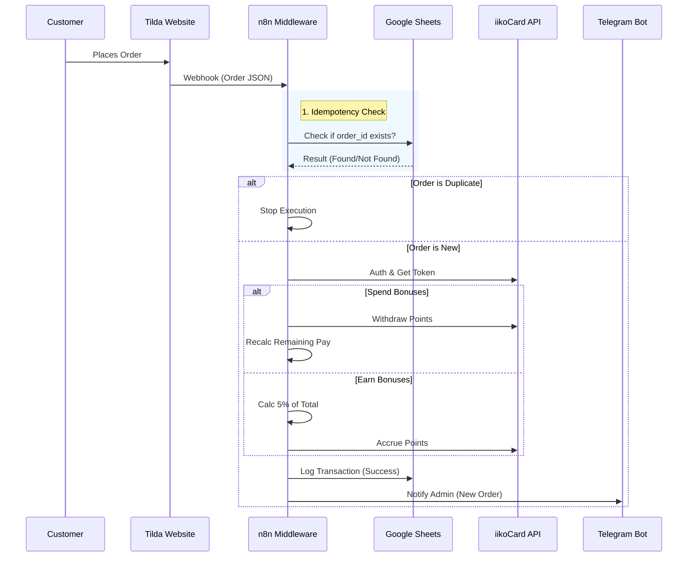

# System Architecture

This project implements a Loyalty System Middleware that connects a frontend website (Tilda) with a backend loyalty engine (iikoCard).

## 🧩 Components

| Component | Type | Role |
| :--- | :--- | :--- |
| **Tilda** | Frontend / Trigger | Captures customer orders and sends Webhooks. |
| **n8n** | Orchestrator | Handles business logic, API transformations, and routing. |
| **iikoCard** | Backend API | Stores customer balances, handles accruals and withdrawals. |
| **Google Sheets** | Database (Lightweight) | Stores execution logs and handles Idempotency (deduplication). |
| **Telegram** | Admin UI | Notifies admins and allows manual refund operations via UI buttons. |
| **WhatsApp** | Notification Service | Sends loyalty updates to customers (via GreenAPI/Wazzup). |

---

## 🔄 Data Flow Diagram

## 🛠 Key Design Decisions

### 1. API Gateway Pattern
n8n acts as a secure middleware. The frontend (Tilda) never communicates with iikoCard directly. This hides API keys and business logic from the public web.

### 2. Idempotency
To prevent double-charging or double-accrual on network retries, every order is checked against a Google Sheets ledger using the unique `order_id` before processing.

### 3. Fail-Safe Operations
*   **Retry Policy:** All HTTP requests to iikoCard have a **3x retry** strategy to handle transient network glitches.
*   **Global Error Handler:** A dedicated workflow catches unexpected failures and logs them for audit.
